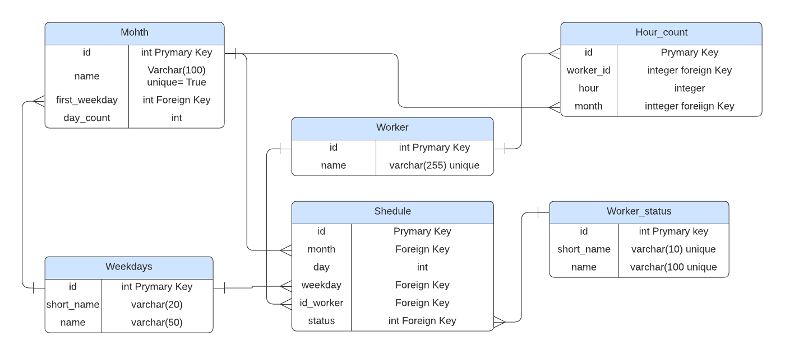

# BIA-Techologies

### Набросок базы данных:

### Программа запускается через main.py
### Но без подключения к базе данных не составит расписание
### график работы 1/2
### число смен в месяц от 9 до 12
### Число сотруднико в обычные дни от 3 до 4
### В понедельник день усиления +1, я выбрал 5 работников
### В воскресенье -1, то есть 2 сотрудника
### shedule.csv - график работы в формате csv
### shedule.json - расписание в формате json
